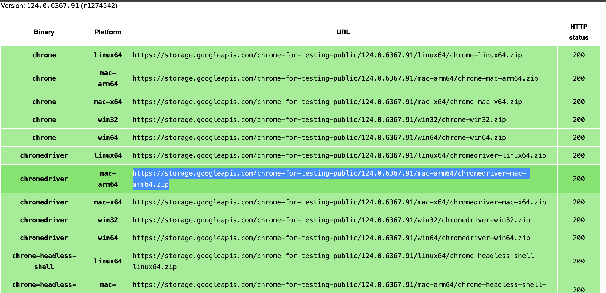

# CoordinadorEventos

## Como usar los scripts de web scraping

### Primero instalar crear y activar un venv de python

```
python -m venv <path to new env>

source <path to new env>/bin/activate
```

Instala los requerimientos

```
pip3 install -r requirements.txt
```

### Descargar driver

Es una parte muy importante para que funcione Selenium.

En este caso se utilizará el driver de chrome, aunque en la [documentación de Selenium](https://selenium-python.readthedocs.io/installation.html) se puede descargar el driver acorde a su navegador.

**Es necesario elegir el binario acorde a su sistema operativo.**

Download chromedriver: [https://googlechromelabs.github.io/chrome-for-testing/]()



Luego de descargar el driver, coloque el path correspondiente en el archivo `scrapers.py`

### Utilizar scraper

Con esto hecho, ya estamos en condiciones de utilizar el script que hará el web scraping.

Desde la terminal, parándonos en la carpeta donde se encuentra `scraper_<plataforma>.py`.

Las plataformas disponibles son:

- redtickets
- tickantel

Se puede utilizar de la siguiente manera:

```
python3 scraper_<plataforma>.py
```

## Como levantar el sistema con docker

Parados sobre la raiz de nuestro directorio ejecutar el siguiente comando:

Primero que nada debemos tener los paquetes necesarios en la API para que la imagen de docker se genere correctamente.
Para esto nos paramos con una terminal en el directorio de API y ejecutamos

```bash
npm install
```

Parados sobre la rail de nuestro directorio ejecutar el siguiente comando:

```bash
docker-compose -f .\docker-compose.yaml up --build
```

Esto hara que se levante la BD y la API, listos para usar.
Por defecto la API se mapea a `localhost:3000`.

## Como probar Node API con archivos http

- En VsCode instalar extension de `REST Client`.
- Entrar a algun archivo .http ubicado en API/http
- Ejecutar la accion con `Send Request`
